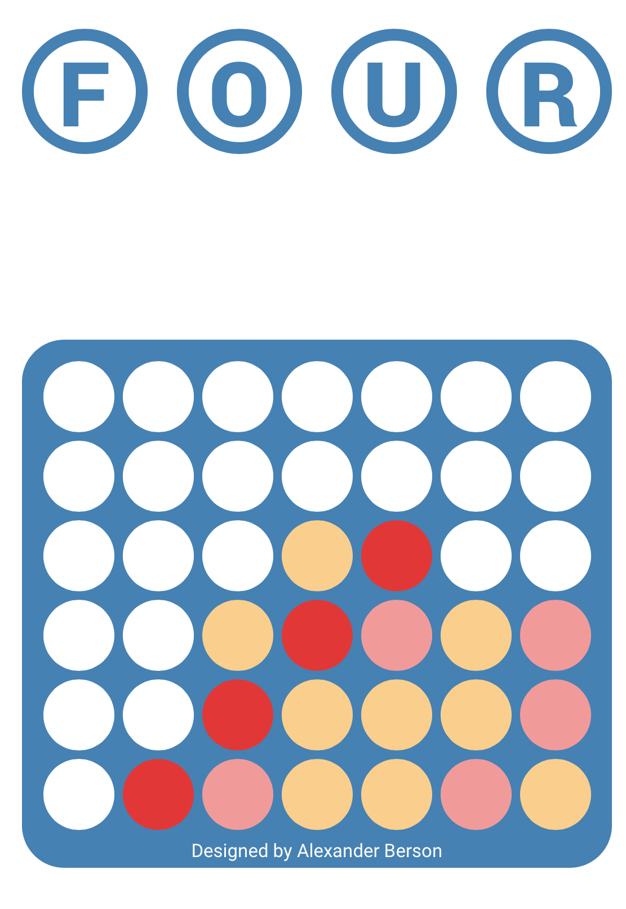

# Connect 4

Be the first to get four of your discs in a row — horizontally, vertically, or diagonally.  
You can [play Connect 4 against the AI online](https://alex-berson.github.io/connect-4/) or  

## Description

**Connect Four** (also known as **Four in a Row**, **Four Up**, **Plot Four**, **Find Four**, **Drop Four**, **Captain's Mistress**, and **Gravitrips**) is a two-player connection board game in which players select a color and take turns dropping colored discs into a seven-column, six-row vertically suspended grid. The discs fall straight down, occupying the lowest available space in the column. The objective is to be the first to form a horizontal, vertical, or diagonal line of four discs of one's own color.

## Screenshot

  

## License

Copyright &copy; 2021-2024 Alexander Berson. This project is licensed under the [MIT license](LICENSE.txt "MIT License").

